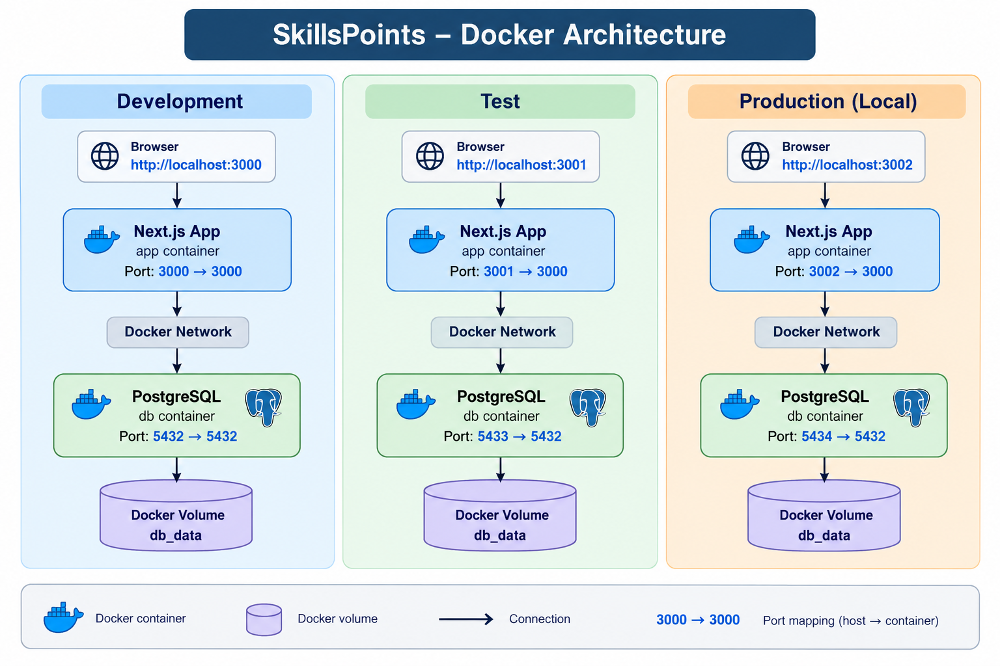

# Docker Documentation – SkillsPoints

## Overview

SkillsPoints uses Docker to provide isolated and reproducible environments for the application and the database.

The project uses Docker to run:

- A Next.js application
- A PostgreSQL database

Three separate environments are configured:

- Development
- Test
- Production

Each environment uses its own ports and database configuration, allowing the environments to run independently without port conflicts.


## Project Structure

The main files and directories related to Docker and environment configuration are:

```text
Skillspoints2026/
├── Dockerfile
├── docker-compose.yml
├── .dockerignore
├── .env
├── .env.example
├── .env.test
├── .env.production
├── prisma/
├── src/
├── test/
└── docs/


## Dockerized Parts

The following parts of SkillsPoints are dockerized:

### Next.js Application

The Next.js application runs inside the `app` container.

The application Docker image is built from the `Dockerfile`.


### PostgreSQL Database

The PostgreSQL database runs inside the `db` container.

The project uses the official `postgres:16-alpine` Docker image.

The application and the database run in separate containers and communicate through the Docker Compose network.


```text
SkillsPoints
│
├── Next.js Application
│   └── app container 
│
└── PostgreSQL Database
    └── db container 

## Docker Architecture

SkillsPoints uses Docker Compose to run the application and the database as separate services.

The architecture contains:

- `app`: the Next.js application container.
- `db`: the PostgreSQL database container.
- A Docker network that allows the containers to communicate.
- A Docker volume used to persist PostgreSQL data.

```text
Browser
   │
   │ localhost:3000
   ▼
┌─────────────────────┐
│ Next.js Application │
│ app container       │
│ Port: 3000          │
└─────────┬───────────┘
          │
          │ DATABASE_URL
          │ Host: db
          ▼
┌─────────────────────┐
│ PostgreSQL          │
│ db container        │
│ Port: 5432          │
└─────────┬───────────┘
          │
          ▼
     Docker Volume
       db_data
```

Inside the Docker network, the application connects to PostgreSQL using the service name `db`.

The application waits for the PostgreSQL service to become healthy before starting.


   ## Environments

SkillsPoints uses three separate Docker environments: Development, Test and Production.

Each environment has its own application container, PostgreSQL container, ports and database configuration.

This separation allows the environments to run simultaneously without port conflicts.

### Development Environment

The Development environment is used during application development.

| Service | Host Port | Container Port |
|---|---:|---:|
| Next.js | 3000 | 3000 |
| PostgreSQL | 5432 | 5432 |

Application:

```text
http://localhost:3000
```

### Test Environment

The Test environment is used to test the application separately from Development.

| Service | Host Port | Container Port |
|---|---:|---:|
| Next.js | 3001 | 3000 |
| PostgreSQL | 5433 | 5432 |

Application:

```text
http://localhost:3001
```

Test database:

```text
skillspoints_test
```

### Production Environment

A separate Production environment is configured locally to simulate the production configuration.

| Service | Host Port | Container Port |
|---|---:|---:|
| Next.js | 3002 | 3000 |
| PostgreSQL | 5434 | 5432 |

Application:

```text
http://localhost:3002
```

The Production environment currently runs locally in Docker. Deployment to a remote production server is a separate step.

## Port Mapping

Docker maps a port on the local machine to a port inside the container.

| Environment | Host | Container |
|---|---:|---:|
| Development | 3000 | 3000 |
| Test | 3001 | 3000 |
| Production | 3002 | 3000 |

This configuration allows multiple environments to run at the same time without port conflicts.

## Test Database Setup

The Test environment uses a dedicated PostgreSQL database.

- Database: `skillspoints_test`
- Port: `5433`

This keeps test data separated from the Development database.

## Prisma Migrations & Seed

The Test database is initialized with Prisma.

### Apply migrations

```bash
npx prisma migrate deploy
```

### Add test data

```bash
npx prisma db seed
```

The seed creates a test user in the Test database.

## Running the Environments

### Start Development

```bash
docker compose up -d
```

### Check running containers

```bash
docker ps
```

### Stop containers

```bash
docker compose down
```
## Architecture Diagram

